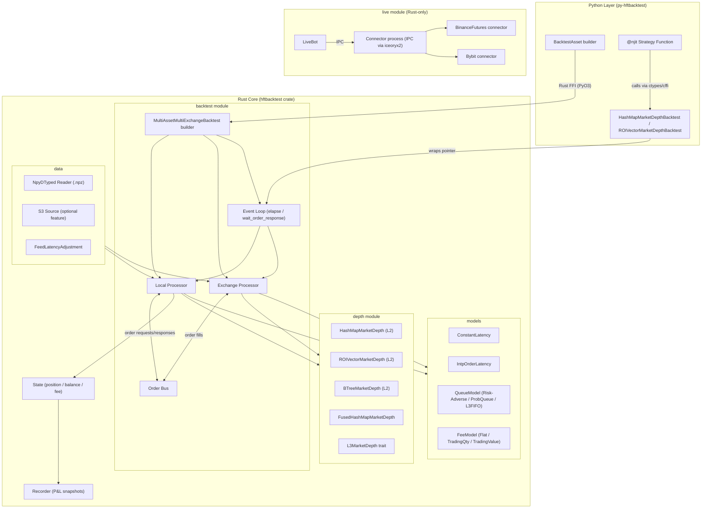
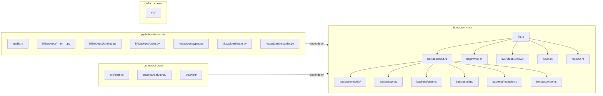

# HftBacktest — Architecture

> **Last Updated**: 2026-04-07T00:00:00Z
> **Git Hash**: `a5e4a18`

## System Architecture Overview

## Trading Paradigm and Key Features

| Paradigm | Description |
|---|---|
| **Tick-by-tick replay** | Every market event is replayed in nanosecond order; no bar aggregation |
| **Dual-timeline simulation** | Separate local and exchange clocks; events dispatched by earliest timestamp |
| **Explicit latency modeling** | Feed delay and order round-trip delay are first-class parameters |
| **Queue-aware fills** | Fill probability depends on queue position, not just price crossing |
| **L2 / L3 support** | Market-By-Price (level 2) and Market-By-Order (level 3) reconstruction |
| **Multi-asset** | Multiple assets and exchanges run in the same simulation session |
| **Live parity** | Same algorithm code is executed in both backtest and live modes |
| **JIT compatibility** | Python strategy functions compile with Numba `@njit` |
| **Fee models** | Flat-per-trade, trading-quantity, and trading-value fee structures |
| **Partial fills** | Optional `PartialFillExchange` model for realistic queue behavior |

## Core Components

### Backtest Engine

The central struct is `MultiAssetMultiExchangeBacktest` (built via `build_hashmap_backtest` / `build_roivec_backtest`). It owns a vector of `(Local, Exchange)` processor pairs, one per asset.

**Source references**:
- Builder and engine: [`hftbacktest/src/backtest/mod.rs`](../hftbacktest/src/backtest/mod.rs)
- Local processor trait: [`hftbacktest/src/backtest/proc/mod.rs`](../hftbacktest/src/backtest/proc/mod.rs)
- Local implementation: [`hftbacktest/src/backtest/proc/local.rs`](../hftbacktest/src/backtest/proc/local.rs)
- Exchange (no partial fill): [`hftbacktest/src/backtest/proc/nopartialfillexchange.rs`](../hftbacktest/src/backtest/proc/nopartialfillexchange.rs)
- Exchange (partial fill): [`hftbacktest/src/backtest/proc/partialfillexchange.rs`](../hftbacktest/src/backtest/proc/partialfillexchange.rs)

### Market Depth Implementations

Four concrete implementations of the `MarketDepth` trait are provided:

| Implementation | Use Case | Source |
|---|---|---|
| `HashMapMarketDepth` | General purpose L2 | [`depth/hashmapmarketdepth.rs`](../hftbacktest/src/depth/hashmapmarketdepth.rs) |
| `ROIVectorMarketDepth` | Cache-friendly, region-of-interest | [`depth/roivectormarketdepth.rs`](../hftbacktest/src/depth/roivectormarketdepth.rs) |
| `BTreeMarketDepth` | Ordered iteration over levels | [`depth/btreemarketdepth.rs`](../hftbacktest/src/depth/btreemarketdepth.rs) |
| `FusedHashMapMarketDepth` | Fused depth from multiple sources | [`depth/fuse.rs`](../hftbacktest/src/depth/fuse.rs) |

The `L2MarketDepth` and `L3MarketDepth` traits extend the base `MarketDepth` trait.

**Source**: [`hftbacktest/src/depth/mod.rs`](../hftbacktest/src/depth/mod.rs)

### Latency Models

| Model | Description | Source |
|---|---|---|
| `ConstantLatency` | Fixed nanosecond entry and response delay | [`models/latency.rs`](../hftbacktest/src/backtest/models/latency.rs) |
| `IntpOrderLatency` | Interpolated from historical latency `.npz` data | [`models/latency.rs`](../hftbacktest/src/backtest/models/latency.rs) |

### Queue / Fill Models

| Model | Description |
|---|---|
| `RiskAdverseQueueModel` | Queue advances only on trades at the same price (conservative) |
| `ProbQueueModel` | Probability-based fill using configurable functions (LogProb, PowerProb) |
| `L3FIFOQueueModel` | True FIFO queue from L3 order book feed |

**Source**: [`hftbacktest/src/backtest/models/queue.rs`](../hftbacktest/src/backtest/models/queue.rs)

### Fee Models

| Model | Description |
|---|---|
| `FlatPerTradeFeeModel` | Fixed fee per trade |
| `TradingQtyFeeModel` | Fee proportional to quantity |
| `TradingValueFeeModel` | Maker/taker fee proportional to notional value |

**Source**: [`hftbacktest/src/backtest/models/fee.rs`](../hftbacktest/src/backtest/models/fee.rs)

### Python Bindings

The Python layer is built with PyO3 and Maturin. Rust structs are exposed as Python objects. Strategy-visible types (Order, depth methods) are wrapped with Numba `@jitclass` for use inside `@njit` functions.

**Source references**:
- PyO3 bindings: [`py-hftbacktest/src/lib.rs`](../py-hftbacktest/src/lib.rs)
- Numba class wrappers: [`py-hftbacktest/hftbacktest/binding.py`](../py-hftbacktest/hftbacktest/binding.py)
- Order jitclass: [`py-hftbacktest/hftbacktest/order.py`](../py-hftbacktest/hftbacktest/order.py)
- Event and dtype definitions: [`py-hftbacktest/hftbacktest/types.py`](../py-hftbacktest/hftbacktest/types.py)

## Module Diagram

## See Also

- [workflow.md](workflow.md) — How events flow through the backtest pipeline
- [state-management.md](state-management.md) — Order book and position state lifecycle
- [development.md](development.md) — Build setup and configuration
