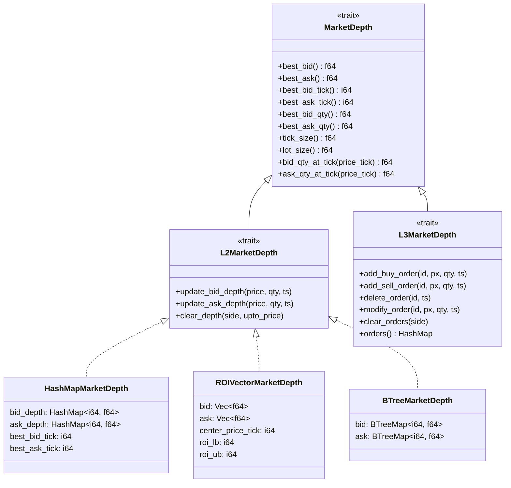
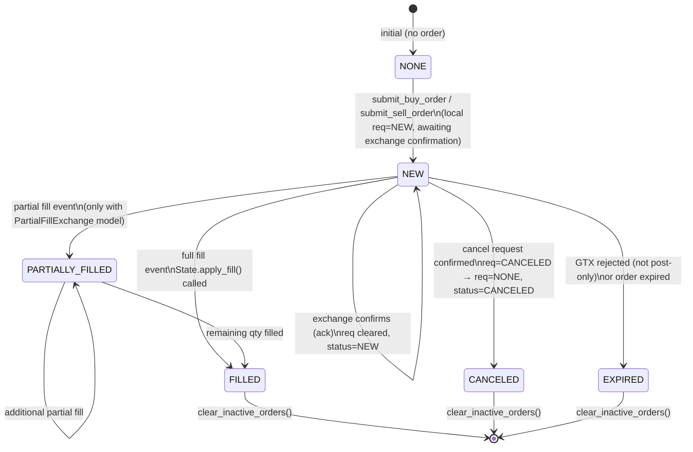

# HftBacktest — State Management

> **Last Updated**: 2026-04-07T00:00:00Z
> **Git Hash**: `a5e4a18`

## Order Book State

The market depth is updated tick-by-tick from the feed. HftBacktest maintains two separate depth views — one for the exchange processor (at exchange timestamps) and one for the local processor (at local timestamps, i.e., after feed latency).

Each asset's depth is stored in one of four concrete implementations of the `MarketDepth` trait:



**Source**: [`hftbacktest/src/depth/mod.rs`](../hftbacktest/src/depth/mod.rs)

### Choosing a Depth Implementation

| Implementation | Memory | Access | Best for |
|---|---|---|---|
| `HashMapMarketDepth` | Sparse | O(1) lookup by price tick | General use, wide price ranges |
| `ROIVectorMarketDepth` | Fixed array | O(1) indexed by offset | Cache-efficient, narrow ROI |
| `BTreeMarketDepth` | Sorted tree | O(log n) | Iterating price levels in order |
| `FusedHashMapMarketDepth` | Sparse | O(1) | Combining multiple data sources |

## Order State Machine

Each order tracked by the local processor transitions through a well-defined set of states:



### Order Fields

The `Order` struct (C-aligned for Numba interop) tracks:

| Field | Type | Description |
|---|---|---|
| `order_id` | `u64` | Unique identifier supplied by the strategy |
| `price_tick` | `i64` | Limit price in ticks |
| `tick_size` | `f64` | Tick size for computing price |
| `qty` | `f64` | Original order quantity |
| `leaves_qty` | `f64` | Remaining unfilled quantity |
| `exec_qty` | `f64` | Executed quantity |
| `exec_price_tick` | `i64` | Execution price in ticks |
| `side` | `i8` | BUY=1, SELL=-1 |
| `status` | `u8` | NONE/NEW/FILLED/CANCELED/EXPIRED/PARTIALLY_FILLED |
| `req` | `u8` | Current pending request type (NONE/NEW/CANCELED) |
| `order_type` | `u8` | LIMIT=0, MARKET=1 |
| `time_in_force` | `u8` | GTC=0, GTX=1, FOK=2, IOC=3 |
| `maker` | `bool` | Whether the fill was as maker |
| `exch_timestamp` | `i64` | Exchange-side timestamp |
| `local_timestamp` | `i64` | Local-side timestamp |

**Source**: [`py-hftbacktest/hftbacktest/order.py`](../py-hftbacktest/hftbacktest/order.py) (Python jitclass), [`hftbacktest/src/types.rs`](../hftbacktest/src/types.rs) (Rust struct)

### Order Cancellability

An order is cancellable only if:
1. `status` is `NEW` or `PARTIALLY_FILLED`
2. `req` is `NONE` (no outstanding request in flight)

```python
if order.cancellable:
    hbt.cancel(asset_no, order.order_id, False)
```

## Position and Balance Tracking

The `State` struct accumulates P&L across fills for each asset:

```rust
pub struct StateValues {
    pub position: f64,      // current net position (+ long, - short)
    pub balance: f64,       // cash balance (decreases on buys)
    pub fee: f64,           // total fees paid
    pub num_trades: i64,    // total number of fills
    pub trading_volume: f64,// cumulative traded quantity
    pub trading_value: f64, // cumulative traded notional
}
```

On each fill, `State::apply_fill` is called:

1. Position is adjusted: `position += exec_qty * side_sign`
2. Balance is adjusted: `balance -= amount * side_sign`
3. Fee is accumulated: `fee += FeeModel::amount(order, amount)`
4. Trade counters are incremented

Equity is computed on demand as a function of the current mid-price via the `AssetType`:

- `LinearAsset`: equity = `mid_price * position + balance - fee`
- `InverseAsset`: equity = `position / mid_price + balance - fee` (inverse perpetual)

**Source**: [`hftbacktest/src/backtest/state.rs`](../hftbacktest/src/backtest/state.rs)

## Recorder

The `Recorder` takes periodic snapshots of trading state (timestamp, mid-price, position, balance, fee, trade counts) and stores them as a NumPy record array for post-backtest analysis.

**Python usage**:
```python
from hftbacktest import Recorder
recorder = Recorder(1, 100_000)  # 1 asset, 100k snapshot capacity
# inside @njit:
recorder.record(hbt)
# after:
print(recorder.df)  # polars DataFrame
```

**Source**: [`hftbacktest/src/backtest/recorder.rs`](../hftbacktest/src/backtest/recorder.rs), [`py-hftbacktest/hftbacktest/recorder.py`](../py-hftbacktest/hftbacktest/recorder.py)

## Event Data Format

Feed events are stored in a NumPy structured array (dtype: `event_dtype`):

| Field | NumPy dtype | Description |
|---|---|---|
| `ev` | `u8` | Event flags (bitfield) |
| `exch_ts` | `i8` | Exchange timestamp (ns) |
| `local_ts` | `i8` | Local receipt timestamp (ns) |
| `px` | `f8` | Price |
| `qty` | `f8` | Quantity |
| `order_id` | `u8` | Order ID (L3 events) |
| `ival` | `i8` | Integer auxiliary value |
| `fval` | `f8` | Float auxiliary value |

**Source**: [`py-hftbacktest/hftbacktest/types.py`](../py-hftbacktest/hftbacktest/types.py)

## See Also

- [architecture.md](architecture.md) — Component diagram and module layout
- [workflow.md](workflow.md) — How events drive state transitions
- [development.md](development.md) — Setup and troubleshooting
