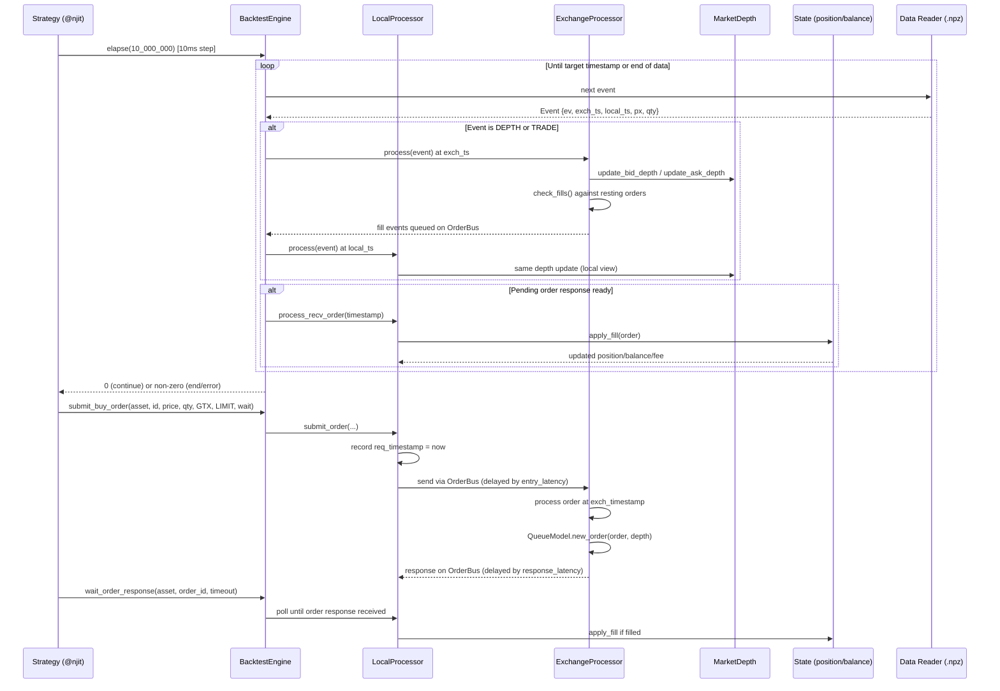
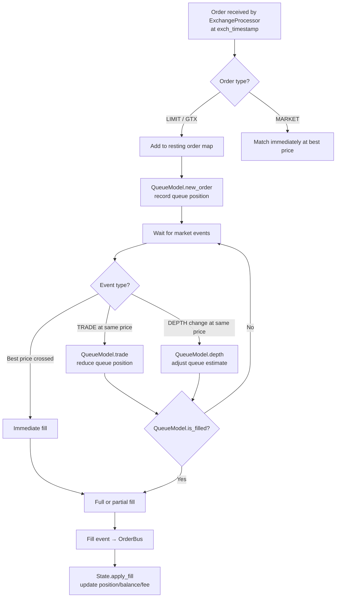

# HftBacktest — Workflow

> **Last Updated**: 2026-04-07T00:00:00Z
> **Git Hash**: `a5e4a18`

## Backtesting Pipeline

The full backtesting pipeline runs as follows: data is loaded from `.npz` files, events are replayed tick-by-tick through the dual local/exchange timeline, orders are submitted and matched using the configured latency and queue models, and results are accumulated in the `State` and optionally snapshotted by the `Recorder`.



## Order Matching Flow

When a new order arrives at the exchange processor, matching proceeds as follows:



**Source references**:
- Exchange processor (no partial fill): [`hftbacktest/src/backtest/proc/nopartialfillexchange.rs`](../hftbacktest/src/backtest/proc/nopartialfillexchange.rs)
- Exchange processor (partial fill): [`hftbacktest/src/backtest/proc/partialfillexchange.rs`](../hftbacktest/src/backtest/proc/partialfillexchange.rs)
- Queue models: [`hftbacktest/src/backtest/models/queue.rs`](../hftbacktest/src/backtest/models/queue.rs)
- Order bus: [`hftbacktest/src/backtest/order.rs`](../hftbacktest/src/backtest/order.rs)

## Latency Simulation

HftBacktest models two distinct latency values for each order:

| Latency | Direction | Applied at |
|---|---|---|
| **Entry latency** | Local → Exchange | When order leaves the strategy; exchange sees it `entry_latency` ns later |
| **Response latency** | Exchange → Local | When exchange acknowledges; strategy sees the response `response_latency` ns later |

Similarly for market data feed:

| Latency | Direction | Applied at |
|---|---|---|
| **Feed latency** | Exchange → Local | Market depth/trade events are visible at `local_ts = exch_ts + feed_latency` |

### Constant Latency

```rust
// entry_latency = 100_000 ns (100us), response_latency = 100_000 ns
ConstantLatency::new(100_000, 100_000)
```

**Source**: [`hftbacktest/src/backtest/models/latency.rs`](../hftbacktest/src/backtest/models/latency.rs)

### Interpolated Historical Latency

```python
asset.intp_order_latency(["latency_data/btcusdt_latency_20240101.npz"])
```

Historical latency data format (`.npz` record array):

| Field | Type | Description |
|---|---|---|
| `req_ts` | `i64` | Request timestamp (ns) |
| `exch_ts` | `i64` | Exchange-received timestamp (ns) |
| `resp_ts` | `i64` | Response-received timestamp (ns) |

`IntpOrderLatency` linearly interpolates between rows to produce latency values at any given timestamp. See [`OrderLatencyRow`](../hftbacktest/src/backtest/models/latency.rs) struct for the C-aligned layout.

## Event Flags

Events in the `.npz` feed use bitfield flags packed into the `ev` (u64) field:

| Flag | Value | Meaning |
|---|---|---|
| `DEPTH_EVENT` | 1 | Order book depth update |
| `TRADE_EVENT` | 2 | Market trade |
| `DEPTH_CLEAR_EVENT` | 3 | Clear order book |
| `DEPTH_SNAPSHOT_EVENT` | 4 | Snapshot of full order book |
| `DEPTH_BBO_EVENT` | 5 | Best bid/offer update only |
| `ADD_ORDER_EVENT` | 10 | L3: add order to book |
| `CANCEL_ORDER_EVENT` | 11 | L3: cancel order |
| `MODIFY_ORDER_EVENT` | 12 | L3: modify order |
| `FILL_EVENT` | 13 | L3: order fill |
| `EXCH_EVENT` | `1 << 31` | Process at exchange timestamp |
| `LOCAL_EVENT` | `1 << 30` | Process at local timestamp |
| `BUY_EVENT` | `1 << 29` | Bid side / buyer-initiated |
| `SELL_EVENT` | `1 << 28` | Ask side / seller-initiated |

**Source**: [`py-hftbacktest/hftbacktest/types.py`](../py-hftbacktest/hftbacktest/types.py)

## Multi-Asset Event Merging

When multiple assets are configured, the engine maintains a priority queue of pending events across all `(Local, Exchange)` processor pairs. At each step, the event with the earliest timestamp is dispatched to the appropriate processor. This ensures time-correct simulation across assets without any global shared state between assets.

## Live Trading Mode

The live mode replaces the data reader with a real-time feed from the `Connector` process. The `Connector` runs as a separate binary communicating over IPC (iceoryx2 shared memory), so the latency between the bot and connector is measured and can be factored into strategy logic.

**Source**: [`hftbacktest/src/live/`](../hftbacktest/src/live/) and [`connector/src/`](../connector/src/)

## See Also

- [architecture.md](architecture.md) — Component diagram and module overview
- [state-management.md](state-management.md) — Order and position state lifecycle
- [development.md](development.md) — Setup and configuration
